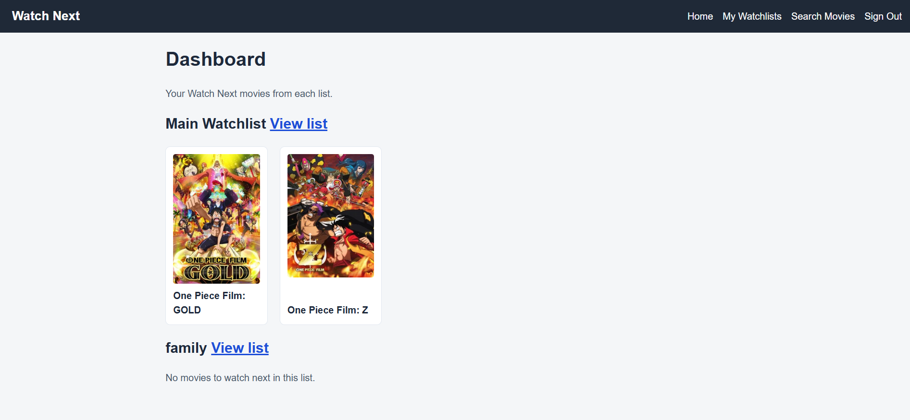
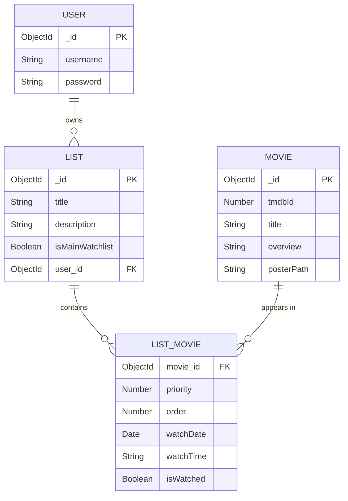

# Watch Next



## About

Watch Next is a movie watchlist tracker built around a priority queue. Search for any movie using the TMDB API, save it to one of your watchlists, and give it a priority so you always know what to watch next.

| Priority | Meaning     |
| -------- | ----------- |
| 1        | Watch Next  |
| 2        | Watch After |
| 3        | Watch Later |
| 4        | Backburner  |

Movies in every list are sorted by priority. If two movies share the same priority, you choose which one comes first with an Order number on the edit page.

Every user gets a Main Watchlist when they sign up, and can create as many extra watchlists as they like.

## Getting Started

- **Deployed app:** [Watch Next on Render](https://your-app-name.onrender.com)
- **Planning materials:** [Project planning board](https://your-planning-link-here)
- **Repository:** [github.com/electricali1/watch-next](https://github.com/electricali1/watch-next)

### ERD

A User owns many Lists. Each List holds many entries, and each entry points to one Movie and stores that list's priority, order, watch date, watch time and watched status for the movie.



### How to use it

1. Sign up for an account. A Main Watchlist is created for you.
2. Go to **Search Movies** and search for a title.
3. Pick a watchlist, a priority and an order number, then click **Add to List**.
4. Open **My Watchlists** to see your lists, or the **Home** dashboard to see every movie marked Watch Next.
5. Click **Edit** on a list to change a movie's priority, order, watch date, watch time or watched status.

### Run it on your computer

1. Clone the repository and run `npm install`.
2. Create a `.env` file in the project folder:

   ```
   MONGODB_URI=your-mongodb-connection-string
   SESSION_SECRET=any-long-random-string
   TMDB_ACCESS_TOKEN=your-tmdb-api-read-access-token
   ```

3. Run `npm start` and open `http://localhost:3000`.

## Technologies Used

- Node.js
- Express
- MongoDB and Mongoose
- EJS
- express-session and connect-mongo (session-based authentication)
- bcrypt (password hashing)
- axios (requests to the TMDB API)
- method-override and morgan
- HTML and CSS (Flexbox)

## Attributions

- Movie data and posters come from [The Movie Database (TMDB)](https://www.themoviedb.org/). This product uses the TMDB API but is not endorsed or certified by TMDB.
- Built as Project 2 for the General Assembly Software Engineering course.

## Next Steps

- Let users share a watchlist with friends.
- Show more movie details, such as genres, runtime and a trailer.
- Add a "random pick" button that chooses a movie from your Watch Next list.
- Let users rate and review movies after watching them.
